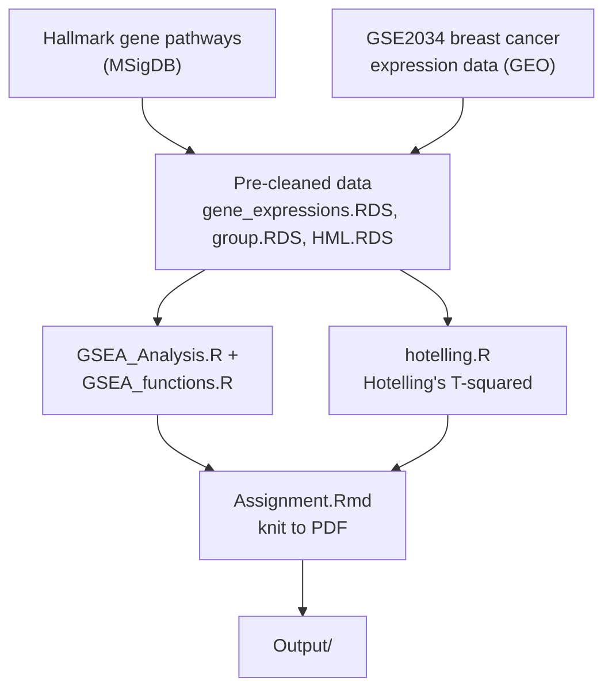

# Gene Set Enrichment Analysis — Multivariate Statistics Project

DSK805 (Multivariate Statistics, SDU) course project applying Gene Set Enrichment Analysis (GSEA) and Hotelling's T² to breast cancer metastasis data.

## Research question

Using 50 Hallmark genetic pathways (Molecular Signatures Database) and the GSE2034 breast cancer gene expression data set (Gene Expression Omnibus), the project studies 5 genetic pathways in relation to breast cancer metastasis, comparing GSEA-based results against a traditional Hotelling's T² group-difference analysis.

## Architecture

## Files

| File | Purpose |
|---|---|
| `Assignment.Rmd` | Main report — knits to PDF, contains GSEA + Hotelling's T² writeup |
| `GSEA_Analysis.R` / `GSEA_functions.R` | GSEA implementation |
| `hotelling.R` | Hotelling's T² group comparison |
| `gene_expressions.RDS`, `group.RDS`, `HML.RDS`, `null_dists.RDS` | Pre-cleaned course-provided data |
| `lottery.R` | Supplementary simulation script |
| `GSEA Analysis .docx` | Analysis writeup (Word format) |

## Running it

Open `Assignment.Rmd` in RStudio and knit to PDF (requires the R packages referenced in the script headers).

## Attribution

Course project template and pre-cleaned data provided by the DSK805 instructor (Henry Kirveslahti), SDU.
